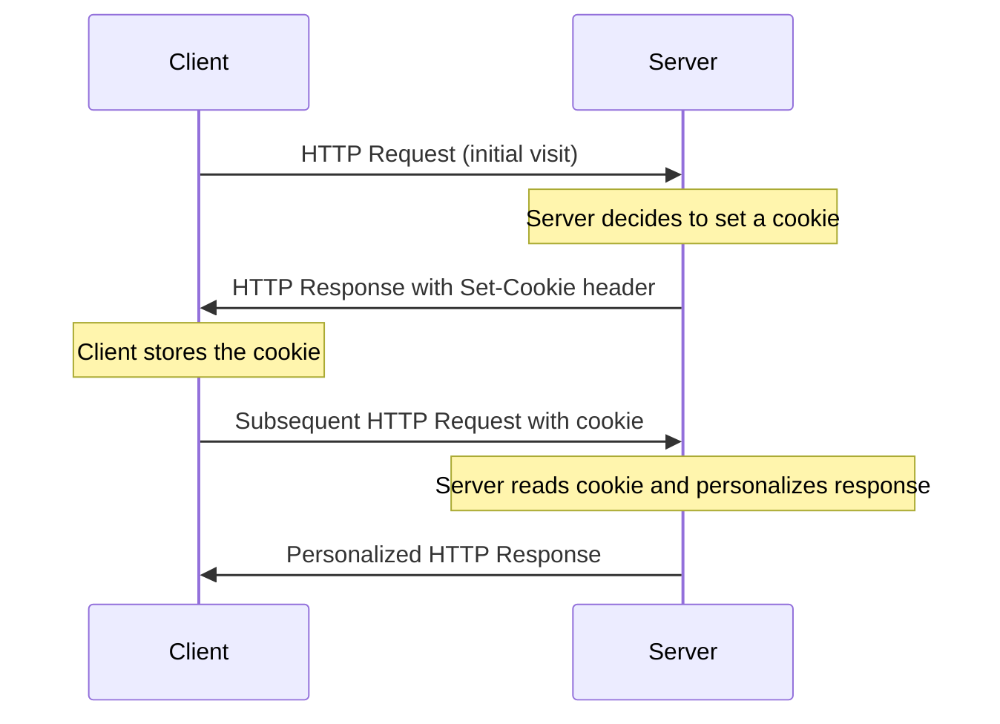
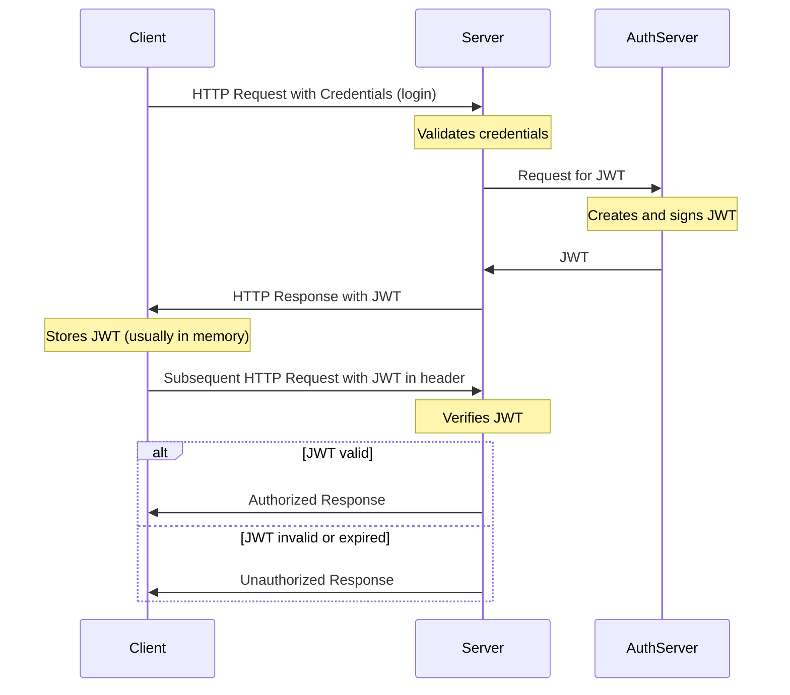

# Application State and User Authentication

## Maintaining State in Web Applications

In any realistic interactive Web application you will come across the need of retaining information between individual pages. This is referred to as "maintaining state" or as the "persistence of data". HTTP protocol does not support this — it is a _stateless_ protocol: every page request starts in a blank state with no knowledge of data that was available on the previous page. Since HTTP is stateless by nature, web applications need to implement their own methods for maintaining state. There are several common strategies to implement this on the server-side.
Choosing the right method for maintaining state depends on the specific requirements of your application, such as the type of data being stored, security considerations, scalability, and whether the state is user-specific or shared across users. It's common to use a combination of these methods to address different aspects of application state.

### Cookies (1)

- Small pieces of data stored on the client's browser. Cookies are sent back to the server with every HTTP request.
- Cookies store variables as name and value pairs, plus additional information such as expiration time and the origin (domain) where the cookie came from.
- By default a website can modify only its own cookies
- Use Cases: Remembering user preferences, authentication tokens, tracking sessions.
- Limitations: Size is limited (typically 4KB), and they can pose security and privacy concerns if not handled correctly.



### Server-Side Sessions

- Server stores session data, and a session identifier is typically sent to the client (often in a cookie or in HTTP headers/URL query params).
- Can be used for user authentication and storing for user-specific data while the user navigates the application.
- Requires server resources and proper management to ensure scalability and security.


### URL Parameters and Query Strings

- Passing state information in URLs as query strings. For example: `https://example.com/app?user=johndoe&theme=dark`.
- Maintaining state across different pages without needing server or client-side storage, such as filtering or search parameters.
- Visible to users, can be modified, and have length limitations.

### Hidden Form Fields

- Storing state information in hidden fields within HTML forms. For example:

  ```html
  <form action="https://example.com/app">
    <input type="hidden" name="user" value="johndoe" />
    <input type="hidden" name="theme" value="dark" />
    <input type="submit" value="Submit" />
  </form>
  ```

- Maintaining state across form submissions.
- Only applicable for state that needs to persist across form submissions.

### Why Cookies and Sessions Are Not Used in RESTful APIs

While cookies and sessions are useful for traditional web applications, **they are not used in RESTful APIs** due to the following reasons:

1. **Statelessness Principle**: REST architecture is based on the principle of statelessness. Each request from a client to a server must contain all the information needed to understand and process the request. The server should not store any client context between requests. Sessions violate this principle because they require the server to maintain state about the client.

2. **Scalability Issues**: Session-based authentication requires the server to store session data, which creates challenges when scaling horizontally across multiple servers. Each server would need access to the same session store, adding complexity and potential bottlenecks.

3. **Cross-Origin Resource Sharing (CORS)**: Cookies have limitations with CORS, making them less suitable for APIs that need to be accessed from different domains or by mobile applications. Browsers handle cookies differently across domains, which can complicate API usage.

4. **Platform Independence**: RESTful APIs are designed to be consumed by various clients (web browsers, mobile apps, IoT devices, etc.). Cookies are browser-specific and not universally supported across all platforms. Token-based authentication works consistently across all client types.

5. **No Automatic Attachment**: Unlike cookies that are automatically sent with every request by browsers, tokens must be explicitly included in request headers. This gives developers more control and makes the authentication mechanism more transparent and intentional.

**Instead of cookies and sessions, RESTful APIs typically use token-based authentication** (such as JWT) where the client includes the token in the request header (usually in the `Authorization` header). This approach maintains statelessness, supports better scalability, and works across different platforms and devices.

### Token-Based Authentication

- Tokens (e.g. [JSON Web Tokens (JWT)](https://jwt.io/)) are used to maintain user state and authentication information.
  - usually used for authentication and authorization purposes, especially in Single Page Applications (SPAs) and API services.
- Consider security in storing and transporting tokens, typically requires HTTPS.

The process of authentication using JWT and subsequent requests with the token in typical client-server interaction:



### Client-Side State Management

- Web Storage API
  - Local Storage: Stores data with no expiration date, and it's accessible across browser sessions.
  - Session Storage: Similar to Local Storage but limited to a single session. The data is cleared when the page session ends.
  - Storing user data like settings, application state, and other temporary data that doesn’t need to persist long-term.
  - Data is only accessible on the client side and limited to about 5 MB.
- Client-Side Frameworks and Libraries like React (with Context API or Redux), Angular (with services), Vue.js (with Vuex) provide their own mechanisms for maintaining state on the client side.

### State in Server

Flask is a minimalistic framework. While it doesn't offer the extensive features of larger frameworks, it does provide built-in mechanisms for maintaining state, specifically through sessions. It is also easy to implement your own state management using cookies or tokens.

---

### Cookies and Sessions

Flask provides built-in support for cookies and sessions:

- **Cookies:**

  - To **read** a cookie, access the `request.cookies` dictionary: `request.cookies.get('cookie_name')`.
  - To **set** a cookie, use the `response` object's `set_cookie` method before returning the response: `response.set_cookie('cookie_name', 'value')`. You'll need to make the response first, e.g., `response = make_response(render_template(...))`.

- **Sessions:** Flask comes with a built-in, secure **session object** . This is the most common and recommended way to manage state.
  - The session data is stored in a **client-side cookie** that is cryptographically **signed** by the server's `SECRET_KEY` to prevent tampering.
  - You access the session like a dictionary:
    - To **set** a value: `session['key'] = 'value'`
    - To **get** a value: `user_id = session.get('user_id')`
  - **Note:** You must set a `SECRET_KEY` in your application configuration for sessions to work securely.

---

### JWT-Based Authentication

For implementing **JSON Web Tokens (JWTs)**, you use standard Python packages:

- **JWT Generation and Verification:** One popular package for generating and verifying JWT tokens is **`PyJWT`**.
  - You `encode` (create) and `decode` (verify) tokens within your Flask routes.
  - This extension provides decorators and utilities to protect routes, extract tokens from headers, and handle refreshing tokens, simplifying the implementation of JWT-based authentication in a Flask application.

## User Authentication and Authorization with JWT

- **Authentication** is the process of verifying the identity of a user.
- **Authorization** is the process of verifying that the user has access to the requested resource.

In web applications, authentication is typically done by verifying a username and password combination. Authorization is typically done by checking the user's role or permissions for the requested resource.

1. Install required packages

Recommended installation using well-maintained libraries. Replace or adapt depending on the extension you prefer (see notes below):

```bash
pip install Flask PyJWT bcrypt python-dotenv
```

Alternative (if you prefer a Flask helper):

```bash
pip install Flask flask-bcrypt PyJWT python-dotenv
```

1. Generate a secret key for signing the tokens and store it in the `.env` file: `JWT_SECRET_KEY=...`

   - Use a long random string.

   - Or use Python's `os.urandom(24).hex()` to generate a string.

   - **Configuration Note:** Flask accesses this key via `os.environ.get('JWT_SECRET_KEY')` (or `os.getenv('JWT_SECRET_KEY')`).

1. Create a route `POST /api/auth/login` that accepts a username and password in the request body.

   - Add a route handler to the Blueprint file: `blueprints/api/v1/auth_routes.py`.

   - The route handler calls the controller method `post_login`, passing the request data.

   <!-- end list -->

   ```python
   # File: blueprints/api/v1/auth_routes.py
   @auth_bp.route('/login', methods=['POST'])
   def login():
       data = request.get_json()
       response, status_code = post_login(data)
       return jsonify(response), status_code
   ```

1. In the _model_ implement a method for verifying the username and password combination and returning the user object if found:

   ```python
   # File: blueprints/api/v1/users/users_model.py
   import bcrypt
   # ... other imports ...

   class User:
       # ... init ...

       @staticmethod
       def verify_credentials(username, password):
           """
           Finds a user by username and verifies the password using bcrypt.
           Returns the User object on success, or None on failure.
           """
           # 1. Look up user by username in the database
           user = User.objects(username=username).first()

           # 2. If user exists, verify password hash using bcrypt
           if user and bcrypt.checkpw(password.encode('utf-8'), user.password_hash.encode('utf-8')):
               return user

           return None
   ```

1. In the controller implement token generation for the logged in user, something like this:

   ```python
   # File: blueprints/api/v1/auth_controller.py
   import jwt
   import datetime
   import os
   from blueprints.api.v1.users.users_model import User

   def post_login(data):
       # ... credential check ...
       username = data.get('username')
       password = data.get('password')
       user = User.verify_credentials(username, password) # Uses bcrypt check internally

       if user:
           jwt_secret = os.getenv('JWT_SECRET_KEY', 'fallback-jwt-secret')

           # 1. Create the payload with expiration time
           payload = {
               'user_id': str(user.id),
               'exp': datetime.datetime.utcnow() + datetime.timedelta(hours=24), # 24h expiration
               'iat': datetime.datetime.utcnow()
           }

           # 2. Encode the token
           token = jwt.encode(payload, jwt_secret, algorithm='HS256')

           # 3. Return the user data and the token
           return {
               'id': str(user.id),
               'username': user.username,
               'email': user.email,
               'role': user.role,
               'token': token
           }, 200
       else:
           return {'message': 'Invalid credentials'}, 401
   ```

   - If the user is found, `jwt.encode()` is used to generate a JWT token. The token is sent back to the client along with the user object.

1. Create a decorator for handling requests to endpoints where authentication is needed in the file `utils/auth_utils.py`.

   - This function, typically named `token_required`, performs token extraction, validation (`jwt.decode()`), user lookup, and passes the user object to the route handler.

   <!-- end list -->

   ```python
   # File: utils/auth_utils.py
   from functools import wraps
   from flask import request, jsonify, current_app
   import jwt
   from jwt import ExpiredSignatureError, InvalidTokenError
   from blueprints.api.v1.users.users_model import User

   def token_required(f):
     """Decorator to require JWT token for protected routes."""
     @wraps(f)
     def decorated(*args, **kwargs):
       auth_header = request.headers.get('Authorization', None)
       if not auth_header:
         return jsonify({'message': 'Authorization header is missing'}), 401

       parts = auth_header.split()
       if parts[0].lower() != 'bearer' or len(parts) != 2:
         return jsonify({'message': 'Authorization header must be in the format: Bearer <token>'}), 401

       token = parts[1]
       try:
         payload = jwt.decode(token, current_app.config.get('JWT_SECRET_KEY'), algorithms=['HS256'])
       except ExpiredSignatureError:
         return jsonify({'message': 'Token has expired'}), 401
       except InvalidTokenError:
         return jsonify({'message': 'Invalid token'}), 401

       user = User.objects(id=payload.get('user_id')).first()
       if not user:
         return jsonify({'message': 'User not found'}), 401

       # Inject the user object into the wrapped route as `current_user`
       return f(current_user=user, *args, **kwargs)

     return decorated
   ```

1. Add a protected route handler that returns the authenticated user's object (single `/me` example):

   ```python
   # File: blueprints/api/v1/auth_routes.py
   @auth_bp.route('/me', methods=['GET'])
   @token_required
   def me(current_user):
     """Returns the authenticated user."""
     # Controller function should return (payload, status_code)
     response, status_code = get_current_user(current_user)
     return jsonify(response), status_code
   ```

   ```python
   # Controller (example)
   def get_current_user(current_user):
     user = User.objects.get(id=current_user.id)
     return UserSchema().dump(user), 200
   ```

1. Test login and the protected route with VS Code REST Client:

   ```http
   ### Post login
   POST http://localhost:3000/api/auth/login
   content-type: application/json

   {
     "username": "JohnDoe",
     "password": "to-be-hashed-pw1"
   }
   ```

   - Check the response and copy the token from the response body.

```http
### Get my user info
GET http://localhost:3000/api/auth/me
Authorization: Bearer <put-your-token-from-login-response-here>
```

- or test with Postman (set 'Bearer Token' on the Authorization tab after successful login POST).

1. Now you can use the authentication decorator with any protected route.

- Information about the authenticated user is passed to the route as the parameter `current_user` injected by `@token_required`.

### Token storage & lifecycle guidance

- Access tokens should be short-lived (e.g., 10–15 minutes). Use refresh tokens to obtain new access tokens without forcing the user to re-login.
- Store access tokens in memory (avoid localStorage where possible) for SPAs to reduce XSS risk. Store refresh tokens in an HttpOnly, Secure cookie and rotate them on refresh where practical.
- For server-rendered apps prefer HttpOnly, Secure cookies for tokens and protect against CSRF (SameSite cookie attribute and/or CSRF tokens).
- Implement token revocation/blacklist (store token `jti` values or session IDs in a server-side store like Redis) to support logout and forced revocation.

### Refresh token (brief overview)

- Use a long-lived refresh token (kept securely) and a short-lived access token. When the access token expires the client uses the refresh token to request a new access token.
- Protect refresh token endpoints with rate limiting and secure storage and rotate refresh tokens after use to mitigate theft.

### JWT verification & error handling

- Always handle `ExpiredSignatureError`, `InvalidTokenError` and return generic 401 responses without revealing internal details. Consider logging the specific error server-side for diagnostics.

### Recommended libraries

- Consider [Flask-JWT-Extended](https://flask-jwt-extended.readthedocs.io/) for a feature-rich, battle-tested set of helpers for access/refresh tokens, decorators, and token revocation support.
- Use `python-dotenv` or another config mechanism to load `JWT_SECRET_KEY` and `SECRET_KEY` from `.env` securely during development.

---

### Example: Flask-JWT-Extended (access + refresh tokens)

Below is a minimal example showing how to use `Flask-JWT-Extended` to create access and refresh tokens, protect endpoints, and implement token revocation using Redis as a simple blacklist store.

```python
from flask import Flask, request, jsonify
from flask_jwt_extended import (
  JWTManager, create_access_token, create_refresh_token,
  jwt_required, get_jwt_identity, get_jwt
)
import os
import redis

app = Flask(__name__)
app.config['JWT_SECRET_KEY'] = os.getenv('JWT_SECRET_KEY')
app.config['JWT_ACCESS_TOKEN_EXPIRES'] = 900  # 15 minutes
jwt = JWTManager(app)

# Simple Redis connection (adjust host/port or use a connection URL)
revoked_store = redis.Redis(host='localhost', port=6379, db=0, decode_responses=True)

@jwt.token_in_blocklist_loader
def check_if_token_revoked(jwt_header, jwt_payload):
  jti = jwt_payload['jti']
  return revoked_store.get(jti) is not None

@app.route('/api/auth/login', methods=['POST'])
def login():
  data = request.get_json() or {}
  username = data.get('username')
  password = data.get('password')
  # TODO: verify username/password and load user_id
  user_id = verify_and_get_user_id(username, password)
  if not user_id:
    return jsonify({'msg': 'Bad credentials'}), 401

  access = create_access_token(identity=user_id)
  refresh = create_refresh_token(identity=user_id)
  return jsonify(access_token=access, refresh_token=refresh), 200

@app.route('/api/auth/refresh', methods=['POST'])
@jwt_required(refresh=True)
def refresh():
  current_user = get_jwt_identity()
  new_access = create_access_token(identity=current_user)
  return jsonify(access_token=new_access), 200

@app.route('/api/auth/logout_access', methods=['DELETE'])
@jwt_required()
def logout_access():
  jti = get_jwt()['jti']
  revoked_store.set(jti, 'true')
  return jsonify(msg='Access token revoked'), 200

@app.route('/api/auth/logout_refresh', methods=['DELETE'])
@jwt_required(refresh=True)
def logout_refresh():
  jti = get_jwt()['jti']
  revoked_store.set(jti, 'true')
  return jsonify(msg='Refresh token revoked'), 200

def verify_and_get_user_id(username, password):
  # Placeholder: implement your user lookup and password check
  # Return a user id (string/int) on success, or None on failure
  return None

```

Notes:

- Use a production-ready Redis configuration and secure connection.
- `Flask-JWT-Extended` also provides helpful callbacks, role/claim support, and utilities to ease implementation; consult the docs for advanced patterns.

## Assignment 5, part A - User authentication

1. Continue your existing Flask app and create a branch `authentication`
1. Implement user authentication to your app
   - Add endpoint `POST /api/auth/login`
   - Use JWT for authentication
   - Continue adapting MVC pattern, use Flask Blueprints to modularize your routes for separate endpoints
1. Implement authorization for protected routes, e.g.:
   - `PUT /api/cats/:id` - only file owner can update cats
   - `DELETE /api/cats/:id` - only file owner can delete cats
   - `PUT /api/users/me` - users can update only their own user info
   - and so on...
1. Implement user roles (e.g. admin, user) with different permissions (role based resource authorization)
   - Regular users can only delete and edit their own data and cats, etc.
     - Modify find() in controllers so that queries will also check that the owner of the item (user_id) matches the `user_id` property in the `current_user` parameter.
   - Admin level users can update or delete any cats, user info, etc.
     - Use e.g. conditional statements in the controllers to decide updates and deletes based on the user level.

---

## Cookies and Sessions in Depth

To effectively manage application state, understanding cookies and sessions is crucial. Here's an in-depth look at both:

### Cookies

- **Definition:** Small pieces of data sent from the server and stored on the client's browser. They are included in every HTTP request to the same server.
- **Storage Location:** Client-side (in the user's browser).
- **Lifespan:** Can be set to expire at a specific time or after a certain duration. Persistent cookies remain until they expire or are deleted, while session cookies are temporary and deleted when the browser is closed.
- **Common Use Cases:**
  - **User Preferences:** Remembering language, theme, or layout preferences.
  - **Shopping Carts:** Keeping track of items added to a cart by the user.
  - **Authentication Tokens:** Maintaining user login sessions.
- **Security Implications:**
  - **HttpOnly Flag:** If set, the cookie cannot be accessed via JavaScript, helping to prevent XSS attacks.
  - **Secure Flag:** Ensures the cookie is only sent over HTTPS, protecting it from being intercepted over unsecure connections.
  - **SameSite Attribute:** Helps to prevent CSRF attacks by controlling when cookies are sent with cross-site requests.
- **Pros and Cons:**

  | Pros                                  | Cons                           |
  | ------------------------------------- | ------------------------------ |
  | Simple to implement                   | Limited storage capacity (4KB) |
  | Supported by all browsers             | Privacy concerns               |
  | Can be made secure (HttpOnly, Secure) | Can be disabled by the user    |

### Sessions

- **Definition:** Server-side storage of user data, with a unique session identifier sent to the client.
- **Storage Location:** Server-side (on the web server), with the session ID stored client-side (usually in a cookie).
- **Lifespan:** Typically tied to the user's session on the website. Can be set to expire after a period of inactivity or at a specific time.
- **Common Use Cases:**
  - **User Authentication:** Keeping users logged in as they navigate the site.
  - **Temporary Data Storage:** Storing data that should not be persisted across sessions, like form inputs or multi-step process data.
- **Security Implications:**
  - Session data is stored on the server, reducing the risk of client-side attacks (like XSS).
  - However, session fixation and cross-site scripting attacks can still pose risks if not properly mitigated.
- **Pros and Cons:**

  | Pros                                                  | Cons                                                               |
  | ----------------------------------------------------- | ------------------------------------------------------------------ |
  | More secure than cookies (data not exposed to client) | Requires server resources                                          |
  | Can store larger amounts of data                      | Needs proper management to prevent issues (e.g., session fixation) |
  | Data can be complex objects                           | Limited by server memory and configuration                         |

### Best Practices for Managing Cookies and Sessions

1. **For Cookies:**

   - Use the Secure, HttpOnly, and SameSite attributes to enhance security.
   - Keep the amount of data in cookies to a minimum. Use them for essential information only.
   - Regularly review and delete old or unused cookies to reduce clutter and potential security risks.

2. **For Sessions:**
   - Implement proper session expiration and renewal mechanisms to prevent session hijacking.
   - Store sensitive data on the server, and use sessions to manage user authentication states.
   - Regularly review and clean up inactive or expired sessions to free up server resources.

### Implementing Cookies and Sessions in Popular Frameworks

- **Flask:**
  - **Cookies:** Use `response.set_cookie()` to set cookies and `request.cookies.get()` to read them.
  - **Sessions:** Flask's session management is built-in. Use `session['key'] = value` to set and `value = session.get('key')` to get session data. Remember to set a `SECRET_KEY` for your app.
- **Express (Node.js):**
  - **Cookies:** Use `res.cookie()` to set cookies and `req.cookies` to access them (requires cookie-parser middleware).
  - **Sessions:** Use express-session middleware. Configure session secret and other options in the session middleware.

### Further Reading and Resources

- [MDN Web Docs on HTTP Cookies](https://developer.mozilla.org/en-US/docs/Web/HTTP/Cookies)
- [OWASP Cookie Security](https://owasp.org/www-community/OWASP_Cookie_Security_Project)
- [Flask Documentation on Sessions](https://flask.palletsprojects.com/en/2.0.x/quickstart/#sessions)
- [Express.js Guide on Using Cookies](https://expressjs.com/en/api.html#res.cookie)
- [JWT.io Introduction to JSON Web Tokens](https://jwt.io/introduction)

Understanding and effectively managing cookies and sessions is vital for building secure and user-friendly web applications. Proper implementation ensures that your application can maintain state, provide personalized experiences, and protect user data across different sessions and interactions.
