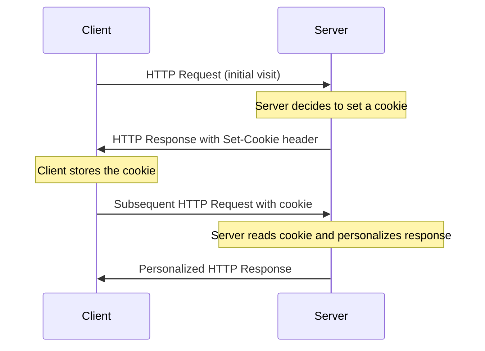
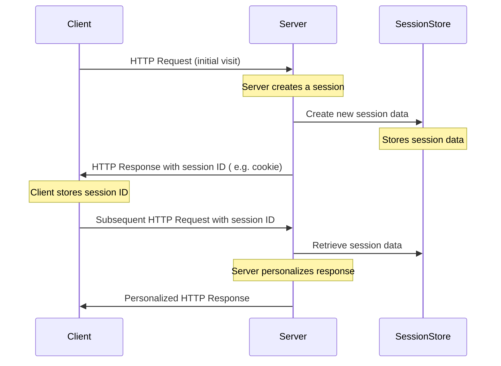
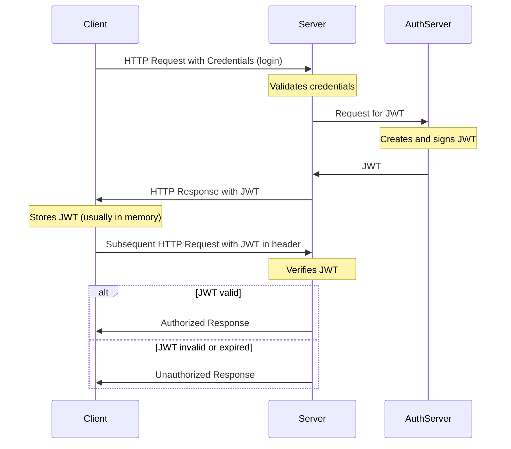

# Application State and User Authentication

## Maintaining State in Web Applications

In any realistic interactive Web application you will come across the need of retaining information between individual pages. This is referred to as "maintaining state" or as the "persistence of data". HTTP protocol does not support this, it is a _stateless_ protocol - every page request starts in a blank state with no knowledge of data that was available on the previous page. Since HTTP is stateless by nature, web applications need to implement their own methods for maintaining state. There is several common strategies to implement this on the server-side.

Choosing the right method for maintaining state depends on the specific requirements of your application, such as the type of data being stored, security considerations, scalability, and whether the state is user-specific or shared across users. It's common to use a combination of these methods to address different aspects of application state.

### Cookies

- Small pieces of data stored on the client's browser. Cookies are sent back to the server with every HTTP request.
- Cookies store variables as name and value pairs, plus additional information such as expiration time and the name of web site where the cookie came form.
- By default web site can modify only it's own cookies
- Use Cases: Remembering user preferences, authentication tokens, tracking sessions.
- Limitations: Size is limited (typically 4KB), and they can pose security and privacy concerns if not handled correctly.



### Server-Side Sessions

- Server stores session data, and a session identifier is typically sent to the client (often in a cookie or in HTTP headers/URL query params).
- Can be used for user authentication and storing for user-specific data while the user navigates the application.
- Requires server resources and proper management to ensure scalability and security.



### URL Parameters and Query Strings

- Passing state information in URLs as query strings. For example: `https://example.com/app?user=johndoe&theme=dark`.
- Maintaining state across different pages without needing server or client-side storage, such as filtering or search parameters.
- Visible to users, can be modified, and have length limitations.

### Hidden Form Fields

- Storing state information in hidden fields within HTML forms. For example:

  ```html
  <form action="https://example.com/app">
    <input type="hidden" name="user" value="johndoe" />
    <input type="hidden" name="theme" value="dark" />
    <input type="submit" value="Submit" />
  </form>
  ```

- Maintaining state across form submissions.
- Only applicable for state that needs to persist across form submissions.

### Token-Based Authentication

- Tokens (e.g. [JSON Web Tokens (JWT)](https://jwt.io/)) are used to maintain user state and authentication information.
  - usually used for authentication and authorization purposes, especially in Single Page Applications (SPAs) and API services.
- Consider security in storing and transporting tokens, typically requires HTTPS.

The process of authentication using JWT and subsequent requests with the token in typical client-server interaction:



### Client-Side State Management

- Web Storage API
  - Local Storage: Stores data with no expiration date, and it's accessible across browser sessions.
  - Session Storage: Similar to Local Storage but limited to a single session. The data is cleared when the page session ends.
  - Storing user data like settings, application state, and other temporary data that doesn’t need to persist long-term.
  - Data is only accessible on the client side and limited to about 5 MB.
- Client-Side Frameworks and Libraries like React (with Context API or Redux), Angular (with services), Vue.js (with Vuex) provide their own mechanisms for maintaining state on the client side.

### State in Server

Flask is a minimalistic framework. While it doesn't offer the extensive features of larger frameworks, it does provide built-in mechanisms for maintaining state, specifically through sessions. It is also easy to implement your own state management using cookies or tokens.

---

### Cookies and Sessions

Flask provides built-in support for cookies and sessions:

- **Cookies:**

  - To **read** a cookie, access the `request.cookies` dictionary: `request.cookies.get('cookie_name')`.
  - To **set** a cookie, use the `response` object's `set_cookie` method before returning the response: `response.set_cookie('cookie_name', 'value')`. You'll need to make the response first, e.g., `response = make_response(render_template(...))`.

- **Sessions:** Flask comes with a built-in, secure **session object** . This is the most common and recommended way to manage state.
  - The session data is stored in a **client-side cookie** that is cryptographically **signed** by the server's `SECRET_KEY` to prevent tampering.
  - You access the session like a dictionary:
    - To **set** a value: `session['key'] = 'value'`
    - To **get** a value: `user_id = session.get('user_id')`
  - **Note:** You must set a `SECRET_KEY` in your application configuration for sessions to work securely.

---

### JWT-Based Authentication

For implementing **JSON Web Tokens (JWTs)**, you use standard Python packages:

- **JWT Generation and Verification:** One popular package for generating and verifying JWT tokens is **`PyJWT`**.
  - You `encode` (create) and `decode` (verify) tokens within your Flask routes.
  - This extension provides decorators and utilities to protect routes, extract tokens from headers, and handle refreshing tokens, simplifying the implementation of JWT-based authentication in a Flask application.

## User Authentication and Authorization with JWT

- **Authentication** is the process of verifying the identity of a user.
- **Authorization** is the process of verifying that the user has access to the requested resource.

In web applications, authentication is typically done by verifying a username and password combination. Authorization is typically done by checking the user's role or permissions for the requested resource.

1. Install PyJWT

   ```bash
   pip install Flask PyJWT py-bcrypt
   ```

2. Generate a secret key for signing the tokens and store it in the `.env` file: `JWT_SECRET_KEY=...`

   - Use a long random string.

   - Or use Python's `os.urandom(24).hex()` to generate a string.

   - **Configuration Note:** Flask accesses this key via `os.environ.get('JWT_SECRET_KEY')` (or `os.getenv('JWT_SECRET_KEY')`).

3. Create a route `POST /api/auth/login` that accepts a username and password in the request body.

   - Add a route handler to the Blueprint file: `blueprints/api/v1/auth_routes.py`.

   - The route handler calls the controller method `post_login`, passing the request data.

   <!-- end list -->

   ```python
   # File: blueprints/api/v1/auth_routes.py
   @auth_bp.route('/login', methods=['POST'])
   def login():
       data = request.get_json()
       response, status_code = post_login(data)
       return jsonify(response), status_code
   ```

4. In the _model_ implement a method for verifying the username and password combination and returning the user object if found:

   ```python
   # File: blueprints/api/v1/users/users_model.py
   import bcrypt
   # ... other imports ...

   class User:
       # ... init ...

       @staticmethod
       def verify_credentials(username, password):
           """
           Finds a user by username and verifies the password using bcrypt.
           Returns the User object on success, or None on failure.
           """
           # 1. Look up user by username in the database
           user = User.objects(username=username).first()

           # 2. If user exists, verify password hash using bcrypt
           if user and bcrypt.checkpw(password.encode('utf-8'), user.password_hash.encode('utf-8')):
               return user

           return None
   ```

5. In the controller implement token generation for the logged in user, something like this:

   ```python
   # File: blueprints/api/v1/auth_controller.py
   import jwt
   import datetime
   import os
   from blueprints.api.v1.users.users_model import User

   def post_login(data):
       # ... credential check ...
       username = data.get('username')
       password = data.get('password')
       user = User.verify_credentials(username, password) # Uses bcrypt check internally

       if user:
           jwt_secret = os.getenv('JWT_SECRET_KEY', 'fallback-jwt-secret')

           # 1. Create the payload with expiration time
           payload = {
               'user_id': str(user.id),
               'exp': datetime.datetime.utcnow() + datetime.timedelta(hours=24), # 24h expiration
               'iat': datetime.datetime.utcnow()
           }

           # 2. Encode the token
           token = jwt.encode(payload, jwt_secret, algorithm='HS256')

           # 3. Return the user data and the token
           return {
               'id': str(user.id),
               'username': user.username,
               'email': user.email,
               'role': user.role,
               'token': token
           }, 200
       else:
           return {'message': 'Invalid credentials'}, 401
   ```

   - If the user is found, `jwt.encode()` is used to generate a JWT token. The token is sent back to the client along with the user object.

6. Create a decorator for handling requests to endpoints where authentication is needed in the file `utils/auth_utils.py`.

   - This function, typically named `token_required`, performs token extraction, validation (`jwt.decode()`), user lookup, and passes the user object to the route handler.

   <!-- end list -->

   ```python
   # File: utils/auth_utils.py (Implements token_required)
   def token_required(func):
       """Decorator to require JWT token for protected routes"""
       # ... implementation using jwt.decode, request.headers, and User.objects ...
       # ... returns func(current_user, *args, **kwargs) on success ...
       # ... returns 401 response on failure ...
   ```

7. Add a new route handler for `GET /api/auth/me` that returns the user object based on the token in the request header:

   ```python
   # File: blueprints/api/v1/auth_routes.py
   @auth_bp.route('/me', methods=['GET'])
   @token_required # Applies the authentication decorator
   def me(current_user): # User object is automatically passed by the decorator
       """Handles GET /api/auth/me: returns the user object from the token via the users controller."""
       response, status_code = get_current_user(current_user)
       return jsonify(response), status_code
   ```

8. Add a new route handler for `GET /api/auth/me` that returns the user object based on the token in the request header:

   ```python
   # Flask blueprint route (users)

   @users_bp.route("/me", methods=["GET"])
   @token_required
   def get_current_user_route(current_user):
       """GET /api/auth/me returns the authenticated user"""
       return get_current_user(current_user)
   ```

   ```python
   # Controller
   def get_current_user(current_user):
       user = User.objects.get(id=current_user.user_id)
       return UserSchema().dump(user), 200
   ```

9. Test login and the protected route with VS Code REST Client:

   ```http
   ### Post login
   POST http://localhost:3000/api/auth/login
   content-type: application/json

   {
     "username": "JohnDoe",
     "password": "to-be-hashed-pw1"
   }
   ```

   - Check the response and copy the token from the response body.

   ```http
   ### Get my user info
   GET http://localhost:3000/api/auth/me
   Authorization: Bearer <put-your-token-from-login-response-here>
   ```

   - or test with Postman (just set 'Bearer token' on 'Authorization' tab after succesful login POST).

10. Now you can use the authentication decorator with any protected route.
    - Information about the authenticated user is passed to the route as the parameter `current_user` injected by `@token_required`.

---

## Assignment 5, part A - User authentication

1. Continue your existing Flask app and create a branch `authentication`
1. Implement user authentication to your app
   - Add endpoint `POST /api/auth/login`
   - Use JWT for authentication
   - Continue adapting MVC pattern, use Flask Blueprints to modularize your routes for separate endpoints
1. Implement authorization for protected routes, e.g.:
   - `PUT /api/cats/:id` - only file owner can update cats
   - `DELETE /api/cats/:id` - only file owner can delete cats
   - `PUT /api/users/me` - users can update only their own user info
   - and so on...
1. Implement user roles (e.g. admin, user) with different permissions (role based resource authorization)
   - Regular users can only delete and edit their own data and cats, etc.
     - Modify find() in controllers so that queries will also check that the owner of the item (user_id) matches the `user_id` property in the `current_user` parameter.
   - Admin level users can update or delete any cats, user info, etc.
     - Use e.g. conditional statements in the controllers to decide updates and deletes based on the user level.
