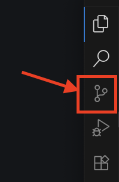

# Git Version Control

Git is a version control system that allows you to track changes in your code, collaborate with others, and manage different versions of your project.

We will be using Git for source code changes, and GitHub for storing and sharing our code.

## 1. Create a GitHub account

- Go to [GitHub](https://github.com/) and sign up for a new account.
- Follow the instructions to create your account.

## 2. Install Git

- Download and install Git from [git-scm.com](https://git-scm.com/downloads).
- Follow the installation instructions for your operating system.
- After installation, you can check if Git is installed correctly by running the following command in your terminal or command prompt:

```bash
git --version
```

This should display the installed version of Git, for example:

```
git version 2.30.1
```

## 3. Configure Git

After installing Git, you need to configure your user name and email address. This information will be used in your commits.

Run the following commands in your terminal or command prompt, replacing `Your Name` and `you@metropolia.fi` with your actual name and email address:

```bash
git config --global user.name "Your Name"
git config --global user.email "you@metropolia.fi"
```

Make sure the email is the same you used to create your GitHub account, please use your `@metropolia.fi` email address.

## 4. Create a new GitHub repository

- Create a new repository on [GitHub](https://github.com/new).
- Follow the instructions to create a new repository.
- After creating the repository, copy the commands under the title "…or create a new repository on the command line".
- Note that the commands must be run in the terminal or command prompt, not in the browser.
  - They must be executed in the folder where your local repository is located.

## 5. Push your changes to GitHub with VSCode

Git can be used from the from Visual Studio Code (VSCode), official documentation in [VSCode docs for version control](https://code.visualstudio.com/docs/sourcecontrol/overview). Check the video.

After making changes to your code, you can push your changes to GitHub with Visual Studio Code (VSCode) by following these steps:



1. Open the Source Control view by clicking on the Git icon in the Activity Bar on the side of the window.

2. You will see a list of changed files. Review the changes and stage the files you want to include in your commit by clicking the "+" icon next to each file.

3. Once you have staged your changes, you can commit them by clicking the checkmark icon at the top of the Source Control view.

4. Finally, push your changes to GitHub by clicking the "..." icon at the top of the Source Control view and selecting "Push".

5. Check your GitHub repository with your browser to see the changes.

## 6. Signup for GitHub Education

- Navigate to [GitHub Education](https://github.com/education).
- Click on "Get benefits" and sign in with your GitHub account.
- Follow the instructions to verify your student status.
- Once verified, you will have access many free tools and services, check more on the [GitHub Education Pack](https://education.github.com/pack) page
- Also check [GitHub Students](https://github.com/education/students) page
