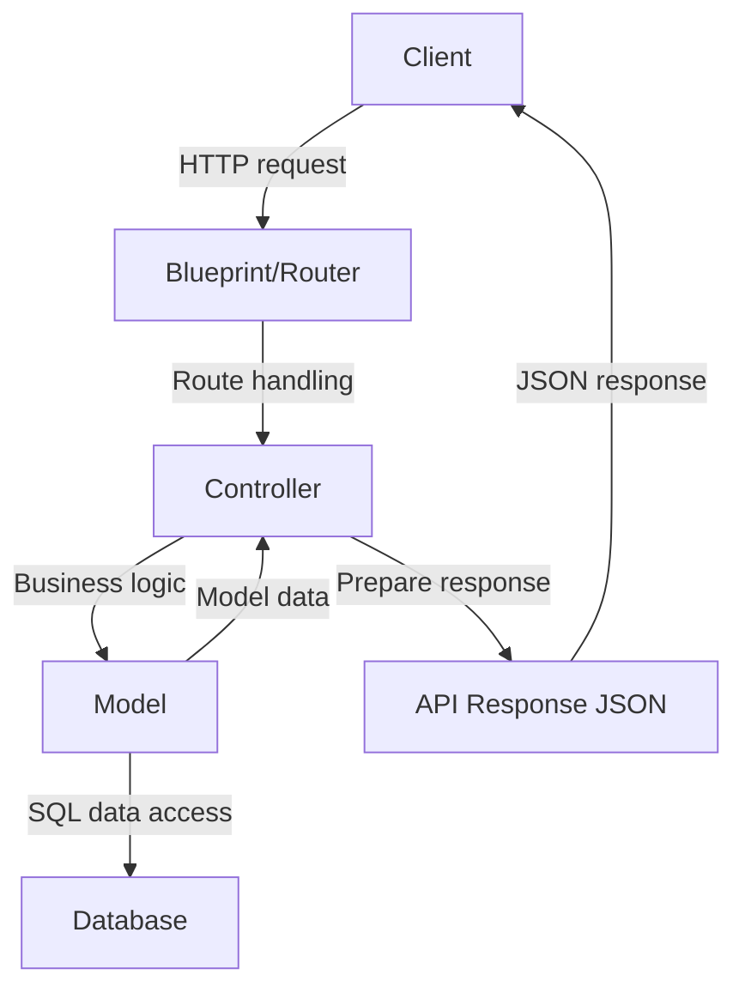

# Blueprints and Application Structure in Flask

## Model-View-Controller (MVC)

MVC is a [design pattern](https://en.wikipedia.org/wiki/Software_design_pattern) that divides the application into three
interconnected components:

- **Model**: Represents the application's data and the business rules that govern access to and updates of this data. In
  many cases, the model component is responsible for retrieving data, processing it, and then storing it. It is
  independent of the user interface (UI).
- **View**: Represents the UI of the application. It displays the data that the model contains to the user and sends
  user commands (e.g., button clicks) to the controller. The view is passive, meaning it waits for the model or
  controller to give it data to display.
- **Controller**: Acts as an intermediary between the Model and the View. It listens to events triggered by the View and
  executes the appropriate response, often resulting in a change in the Model's state. Similarly, when the Model
  changes (e.g., data is updated), the Controller is responsible for refreshing the View.

Benefits of MVC:

- Separation of Concerns: By separating the application into these components, MVC aids in the organization of code,
  making it more modular and scalable. Each component has a distinct responsibility.
- Maintainability: With clear separations, developers can work on one aspect of an application (like the UI) without
  having to touch the data logic code. This separation allows teams to work on different parts of an application
  simultaneously.
- Flexibility: The View and the Model can evolve separately. Multiple Views can be created from one Model, which is
  especially useful when you have web, mobile, and other UIs for the same data.
- Reusability: Business logic in the Model can often be reused across different parts of an application or even
  different projects.

Many popular web development frameworks like Django (Python), Ruby on Rails (Ruby), ASP.NET MVC (C#), and **Flask**
with Jinja2 templates implement the MVC pattern or variations of it. The MVC pattern has been adapted in slightly different
ways by various frameworks, but the core principle remains:

1. When a user sends an HTTP request, the request first reaches the Controller.
2. The Controller processes the request, interacts with the Model (which might involve querying a database), and then
   decides which View should be used to display the resulting data.
3. The View takes the data, renders it, and sends the resulting webpage back to the user (server-side rendering, SSR).



## Project structure

Typical for Flask applications:

```text
my-project/
│
├── api/
│   ├── v1/
│   │   ├── cats/
│   │   │   ├── cats_routes.py
│   │   │   ├── cats_controller.py
│   │   │   └── cats_model.py
|   |   |
|   |   ├── users/
|   |   │   ├── users_routes.py
|   |   │   └── users_controller.py # uses user_model.py from models/
|   |   |
|   |   └── auth/
|   |       ├── auth_routes.py
|   |       └── auth_controller.py # uses user_model.py from models/
│   │
│   └── utils/
│       ├── validators.py
│       └── decorators.py
│
├── models/
│   └── user_model.py # Models shared across versions
│
├── app.py
├── requirements.txt
├── .env.example
├── .gitignore
└── README.md
```

This structure is simple and straightforward, making it easy to navigate the project. It groups files by their technical role (routes, controllers, models), which helps maintain clear separation of concerns in your Flask application.

## Blueprints in Flask

[Flask Blueprints](https://flask.palletsprojects.com/en/stable/blueprints/) are a way to organize your Flask application into components.
They allow you to modularize your routes into separate files and create reusable application components.

### Example

_app.py:_

```python
from flask import Flask
from api.v1.routes.cat_routes import cats_bp

app = Flask(__name__)

# Register blueprints
app.register_blueprint(cats_bp)

""" Register other blueprints similarly """
# app.register_blueprint(users_bp)
# app.register_blueprint(example_bp)

if __name__ == '__main__':
    app.run(host='127.0.0.1', port=5000, debug=True)
```

_api/v1/v1/routes/cat_routes.py:_

```python
from flask import Blueprint, request, jsonify
# Double dot (..) means "from parent package"
# This file is in api/routes/, so .. goes up to api/, then imports from api/controllers/
from ..controllers.cat_controller import (
    get_cats,
    get_cat_by_id,
    create_cat,
    update_cat,
    delete_cat
)

cats_bp = Blueprint('cats', __name__, url_prefix='/api/v1/cats')

@cats_bp.route('/', methods=['GET'])
def get_all_cats():
    return get_cats()

@cats_bp.route('/', methods=['POST'])
def add_cat():
    return create_cat()

@cats_bp.route('/<int:cat_id>', methods=['GET'])
def get_cat(cat_id):
    return get_cat_by_id(cat_id)

@cats_bp.route('/<int:cat_id>', methods=['PUT'])
def modify_cat(cat_id):
    return update_cat(cat_id)

@cats_bp.route('/<int:cat_id>', methods=['DELETE'])
def remove_cat(cat_id):
    return delete_cat(cat_id)
```

_api/v1/controllers/cat_controller.py:_

```python
from flask import request, jsonify
from ..models.cat_model import add_cat, find_cat_by_id, list_all_cats

def get_cats():
    """Get all cats"""
    cats = list_all_cats()
    return jsonify(cats), 200

def get_cat_by_id(cat_id):
    """Get a specific cat by ID"""
    cat = find_cat_by_id(cat_id)
    if cat:
        return jsonify(cat), 200
    else:
        return jsonify({'error': 'Cat not found'}), 404

def create_cat():
    """Create a new cat"""
    data = request.get_json()
    result = add_cat(data)
    if result.get('cat_id'):
        return jsonify({'message': 'New cat added.', 'result': result}), 201
    else:
        return jsonify({'error': 'Bad request'}), 400

def update_cat(cat_id):
    """Update a cat by ID"""
    return jsonify({'message': 'Cat item updated.'}), 200

def delete_cat(cat_id):
    """Delete a cat by ID"""
    return jsonify({'message': 'Cat item deleted.'}), 200
```

_api/v1/models/cat_model.py:_

```python
# Mock data
cat_items = [
    {
        'cat_id': 9592,
        'cat_name': 'Frank',
        'weight': 11,
        'owner': 3609,
        'filename': 'f3dbafakjsdfhg4',
        'birthdate': '2021-10-12',
    },
    {
        'cat_id': 9590,
        'cat_name': 'Mittens',
        'weight': 8,
        'owner': 3602,
        'filename': 'f3dasdfkjsdfhgasdf',
        'birthdate': '2021-10-12',
    },
]

def list_all_cats():
    """Return all cats"""
    return cat_items

def find_cat_by_id(cat_id):
    """Find a cat by ID"""
    return next((cat for cat in cat_items if cat['cat_id'] == cat_id), None)

def add_cat(cat):
    """Add a new cat"""
    cat_name = cat.get('cat_name')
    weight = cat.get('weight')
    owner = cat.get('owner')
    filename = cat.get('filename')
    birthdate = cat.get('birthdate')

    new_id = cat_items[0]['cat_id'] + 1
    new_cat = {
        'cat_id': new_id,
        'cat_name': cat_name,
        'weight': weight,
        'owner': owner,
        'filename': filename,
        'birthdate': birthdate
    }
    cat_items.insert(0, new_cat)
    return {'cat_id': new_id}
```

---

## Assignment

1. Create a new branch `Assignment2`
2. To make the Flask app more modular, update `app.py` to use the application factory pattern:

   ```python
   from flask import Flask

   def create_app():
       app = Flask(__name__)

       @app.route('/')
       def index():
           return {'message': 'Welcome to my REST API!'}

       return app


    app = create_app()
    app.run(host='127.0.0.1', port=5000, debug=True)
   ```

3. Create a new folder `api` in your folder, within it create a folder `v1`
4. Populate `api/v1/` folder with the following folders and files:
   - `routes/` - for route definitions (blueprints)
   - `controllers/` - for business logic
   - `models/` - for data access logic
5. Based on the examples above, create a Flask project with the following routes:
   - `GET /api/v1/cat` - returns all cats
   - `GET /api/v1/cat/<id>` - returns one cat by id
   - `POST /api/v1/cat` - adds a new cat
   - `PUT /api/v1/cat/<id>` - return hard coded json response: `{'message': 'Cat item updated.'}`
   - `DELETE /api/v1/cat/<id>` - return hard coded json response: `{'message': 'Cat item deleted.'}`
6. Test the endpoints using:

   - [Postman](https://www.postman.com/downloads/)
   - [HTTPie](https://httpie.io/) - command line tool: `http GET http://localhost:5000/api/v1/cat`
   - [requests](https://requests.readthedocs.io/) library in Python
   - Or the `curl` command

   Get all cats, add a new cat with POST, then get all cats again to see if the new cat is added.

7. Use the above examples to create routes for users. Create similar dummy data:

   ```python
   user_items = [
     {
        'user_id': 3609,
        'name': 'John Doe',
        'username': 'johndoe',
        'email': 'john@metropolia.fi',
        'role': 'user',
        'password': 'password',  # Note: Never store plain text passwords in production!
     },
     # etc...
   ]
   ```

8. Add the following endpoints:
9. `GET /api/v1/user` - returns all users
10. `GET /api/v1/user/<id>` - returns one user by id
11. `POST /api/v1/user` - adds a new user
12. `PUT /api/v1/user/<id>` - return hard coded json response: `{'message': 'User item updated.'}`
13. `DELETE /api/v1/user/<id>` - return hard coded json response: `{'message': 'User item deleted.'}`
14. Commit and push your branch changes to the remote repository.
15. Merge the `Assignment2` branch to the `main` branch and push the changes to the remote repository.

### Testing Tips

Example using `REST client`:

```http
## GET all cats
GET http://localhost:5000/api/v1/cat

## GET one cat
GET http://localhost:5000/api/v1/cat/9592

## POST new cat
POST http://localhost:5000/api/v1/cat
Content-Type: application/json

{"cat_name": "Fluffy", "weight": 7, "owner": 3610, "filename": "fluffy.jpg", "birthdate": "2022-03-15"}

## PUT update cat
PUT http://localhost:5000/api/v1/cat/9592
Content-Type: application/json

{"cat_name": "Frank Updated", "weight": 12}

## DELETE cat
DELETE http://localhost:5000/api/v1/cat/9592
```

Example using Python `requests` library:

```python
import requests

# GET all cats
response = requests.get('http://localhost:5000/api/v1/cat')
print(response.json())

# POST new cat
new_cat = {
    'cat_name': 'Fluffy',
    'weight': 7,
    'owner': 3610,
    'filename': 'fluffy.jpg',
    'birthdate': '2022-03-15'
}
response = requests.post('http://localhost:5000/api/v1/cat', json=new_cat)
print(response.json())
```
